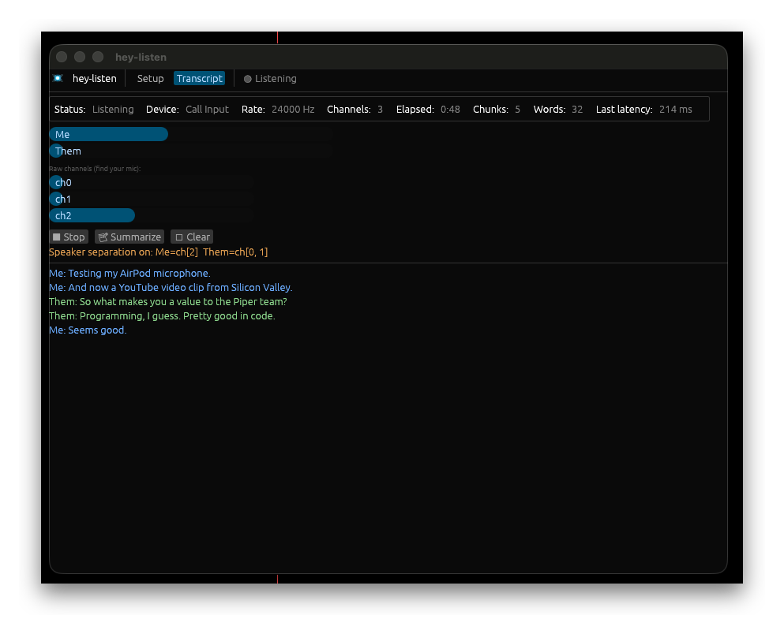

<p align="center">
  
</p>

# hey-listen

hey-listen transcribes your Mac's call audio on your own machine. It also
summarizes the transcript. No audio leaves your Mac. It costs nothing to run.

The name and logo nod to Navi from The Legend of Zelda — "Hey! Listen!"

<p align="center">
  
</p>

## What it does

- It records one macOS input device with `cpal`.
- It cuts the audio at natural pauses into chunks.
- It transcribes each chunk with `whisper-cli` (whisper.cpp) on the Apple GPU.
- It labels each line `Me` or `Them` when you enable speaker separation.
- It summarizes the transcript with a local Ollama model.

It works with any app: Zoom, Google Meet, Slack Huddle, FaceTime, or a phone
call routed to your Mac. It records at the audio-device level, not inside the app.

## Requirements

- macOS on Apple Silicon. whisper.cpp uses the Metal GPU. (Intel Macs run on the
  CPU. This is not verified.)
- Rust and Cargo. Install from https://rustup.rs.
- Homebrew. Install from https://brew.sh.
- Ollama, for the summary only. Install from https://ollama.com.

## Install

Run these steps once.

1. Install BlackHole, a virtual audio driver. This step asks for your password.
   ```
   brew install blackhole-2ch
   ```
2. Install whisper.cpp.
   ```
   brew install whisper-cpp
   ```
3. Download a whisper model into `models/`.
   ```
   curl -L -o models/ggml-base.en.bin \
     https://huggingface.co/ggerganov/whisper.cpp/resolve/main/ggml-base.en.bin
   ```
4. Start Ollama and pull a model (for the summary).
   ```
   ollama serve            # if it is not already running
   ollama pull llama3.1:8b
   ```
5. Build hey-listen.
   ```
   cargo build --release
   ```

### Models

A bigger model is more accurate but slower. Put any of these in `models/` and
pass it with `--model`.

| File | Size | Notes |
|------|------|-------|
| `ggml-base.en.bin` | ~142 MB | Fast. English only. The default. |
| `ggml-small.en.bin` | ~466 MB | More accurate. |
| `ggml-medium.en.bin` | ~1.5 GB | More accurate still. |

## Set up the audio devices

macOS does not let an app record system output directly. So you route the call
audio through BlackHole, and you combine it with your microphone. You do this
once in **Audio MIDI Setup** (in `/Applications/Utilities`).

### 1. Create a Multi-Output Device (so you still hear the call)

1. Click **+** at the bottom-left. Choose **Create Multi-Output Device**.
2. Check **BlackHole 2ch** and your **AirPods** (or your speakers).
3. Rename it `Call Output`.
4. During a call, set the system output to `Call Output`.

### 2. Create an Aggregate Device (this is what hey-listen records)

1. Click **+**. Choose **Create Aggregate Device**.
2. Check **BlackHole 2ch** and your **microphone**.
3. Rename it `Call Input`.
4. Leave **Drift Correction** checked on **BlackHole 2ch**.

> **Do not put a Bluetooth headset mic in the input aggregate.** A Bluetooth mic
> forces macOS into hands-free mode: 24 kHz, mono, one channel. hey-listen then
> records only that one channel, and the call sound drops in quality for everyone.
> Keep AirPods in the **output** only. Use the built-in mic for the input.
>
> One exception: on a real call where the app already uses the AirPods mic, the
> link is already in hands-free mode. Adding the AirPods mic to the input then
> costs no extra quality. See the echo note under Troubleshooting.

## Run

Start the GUI:

```
cargo run --release --features gui --bin hey-listen-gui
```

Or use the command line:

```
# list input devices and their channel counts
./target/release/hey-listen --list-devices

# record both sides of a call
./target/release/hey-listen --device "Call Input"

# record only your mic (no BlackHole needed)
./target/release/hey-listen
```

The command-line app prints each line as it transcribes. Press **Ctrl-C** to
stop. It then writes the summary. It saves the transcript and the summary under
`transcripts/`.

## Find your channels (speaker separation)

Speaker separation labels each line `Me` or `Them`. It does not guess voices. It
uses one fact: your Aggregate Device carries the two speakers on separate
channels. Your mic is on one channel. BlackHole (the far side) is on the others.
hey-listen transcribes each group on its own and labels it.

The channel numbers follow the order of the sub-devices in the aggregate. So the
mic is not always channel 0. Use the **Raw channels** meters in the GUI to find it:

1. Play the far side (or a video) and stay quiet. The BlackHole channels move.
2. Speak. The channel that moves is your mic.
3. Set **My channels** to your mic channel. Set **Their channels** to the rest.

Example: BlackHole is first in the aggregate, so `ch0` and `ch1` are the far
side, and `ch2` is your mic.

```
./target/release/hey-listen --device "Call Input" --separate \
    --me-channels 2 --them-channels 0,1
```

hey-listen prints the mapping it uses, for example `Me=ch[2]  Them=ch[0, 1]`. If
the labels come out swapped, swap the two channel lists.

## How chunking works

hey-listen cuts the audio at natural pauses, not on a fixed clock. So a word is
not split at a boundary. Three rules decide a cut:

1. **Pause** — cut after a silence of `--silence-ms` (default 700 ms).
2. **Minimum** — do not cut a chunk shorter than `--min-seconds` (default 3 s).
3. **Maximum** — force a cut after `--max-seconds` (default 15 s), even with no pause.

## Options

| Flag | Meaning | Default |
|------|---------|---------|
| `--list-devices` | List input devices, then exit. | — |
| `--device <SUBSTR>` | Record from the device whose name contains SUBSTR. | system default |
| `--model <PATH>` | Whisper model file. | `models/ggml-base.en.bin` |
| `--whisper-bin <NAME>` | whisper binary name or path. | `whisper-cli` |
| `--max-seconds <N>` | Force a cut after N seconds. | `15` |
| `--min-seconds <N>` | Never cut a chunk shorter than N seconds. | `3` |
| `--silence-ms <N>` | Cut after a pause of N milliseconds. | `700` |
| `--ollama-model <NAME>` | Ollama model for the summary. | `llama3.1:8b` |
| `--no-summary` | Skip the summary on exit. | off |
| `--separate` | Label lines Me / Them by channel. | off |
| `--me-channels <LIST>` | Channels for your voice. | `0` |
| `--them-channels <LIST>` | Channels for the far side. | all but 0 |

The GUI sets the same options from its Setup tab. The command line does not need
any flag for a summary, because it summarizes on exit. The GUI summarizes when
you click **Summarize**.

## Troubleshooting

**It shows "1 channel" and records only my voice.**
Your input device is mono. Almost always, a Bluetooth mic (AirPods) is in the
Aggregate Device. Remove it. Use the built-in mic and BlackHole. hey-listen picks
the config with the most channels, so a correct aggregate shows 3 or 4 channels.

**The far side is missing.**
Check two things. First, the call app's output must be `Call Output`, so its
audio reaches BlackHole. Second, BlackHole must be in the `Call Input` aggregate.
Confirm the channel counts with `--list-devices`.

**The first run waits many seconds before any text.**
whisper.cpp compiles its Metal GPU shaders once, then caches them. The first run
on a machine can take 10–60 seconds. Later runs take about 0.2 s per chunk. This
is a one-time cost, not a hang.

**The far side appears on my track too.**
Your channel mapping is wrong. `Me` is pointing at a BlackHole channel. Use the
Raw channels meters to find your mic channel (see "Find your channels").

**My voice and the far side mix on one track (echo).**
You chose the AirPods mic while you also play audio to the AirPods. The mic then
picks up the playback. A real call app cancels this echo; hey-listen's raw tap
does not. Use the built-in mic instead, or accept the echo.

**"[BLANK_AUDIO]" lines.**
That is whisper's marker for a silent chunk. hey-listen filters it out.

## How it works

```
[audio device] -> cpal callback -> channel -> worker thread
                                                  |
   at each pause: pick channels -> resample to 16 kHz -> WAV
                                                  |
                          whisper-cli -> text -> events -> UI + transcript file
                                                  |
                          (on request) transcript -> Ollama -> summary
```

The audio hardware calls a real-time callback. That callback must return fast, or
the audio glitches. So the callback only copies samples into a channel. A worker
thread does the slow work: resample, WAV, and whisper. The engine reports every
result as an event. The CLI prints the events. The GUI draws them. One engine
serves both.

## Cost

hey-listen costs nothing to run. whisper.cpp and Ollama both run on your Mac. The
only cost is CPU and GPU time.

## Recording consent

Recording a call can need consent from the other people, based on where you and
they are. Get consent before you record. This tool does not do that for you.

## License

hey-listen uses the MIT License. See [LICENSE](LICENSE).

## Project layout

```
src/
  lib.rs        library root: declares the modules below
  engine.rs     the core: capture -> chunk -> transcribe; emits Events; Session
  config.rs     the Config struct (every option), shared by CLI and GUI
  chunker.rs    silence-based chunking: cut at pauses, with min/max bounds
  audio.rs      cpal capture: pick a device, open a stream, forward samples
  dsp.rs        pick channels, resample to 16 kHz, write WAV, measure loudness
  whisper.rs    run whisper-cli and read back the text
  summarize.rs  POST the transcript to the local Ollama API
  main.rs       CLI binary: parse args, drive the engine, print events
  gui.rs        GUI binary (feature "gui"): an egui window over the same engine
assets/         the Navi logo (SVG + PNG) and the app icon
```

Two binaries share one library:

- `hey-listen` — the CLI. Run `cargo run --release`.
- `hey-listen-gui` — the window. Run `cargo run --release --features gui --bin hey-listen-gui`.
